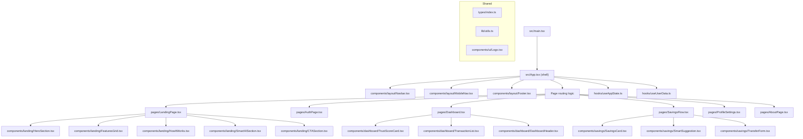
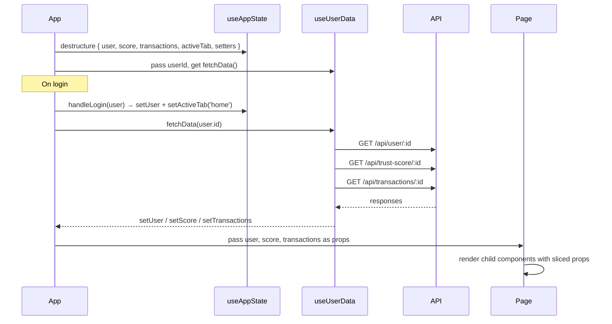

# Design Document: FinUI Modular Refactor

## Overview

The current `src/App.tsx` is a monolithic 1612-line file containing all UI components, types, state management, and business logic for the FinUI application. This refactor extracts each logical concern into its own module, establishing a clean component hierarchy, shared type definitions, reusable hooks, and utility functions — without changing any visible behavior or API contracts.

The result is a maintainable, scalable codebase where each file has a single responsibility, imports are explicit, and new features can be added in isolation.

---

## Architecture



---

## Proposed Directory Layout

```
src/
├── App.tsx                          # Shell: nav + routing only (~60 lines)
├── main.tsx                         # Unchanged
├── index.css                        # Unchanged
│
├── types/
│   └── index.ts                     # User, Transaction, TrustScore interfaces
│
├── lib/
│   └── utils.ts                     # cn() utility (clsx + twMerge)
│
├── hooks/
│   ├── useAppState.ts               # activeTab, user, score, transactions state
│   └── useUserData.ts               # fetchData() — API calls for user/score/txns
│
├── components/
│   ├── ui/
│   │   └── Logo.tsx                 # SVG Logo component
│   │
│   ├── layout/
│   │   ├── Navbar.tsx               # Desktop top navigation bar
│   │   ├── MobileNav.tsx            # Fixed bottom mobile navigation
│   │   └── Footer.tsx               # Site footer
│   │
│   ├── landing/
│   │   ├── HeroSection.tsx          # Hero banner with CTA
│   │   ├── FeaturesGrid.tsx         # Bento grid (Trust Score, Micro-Savings, Credit)
│   │   ├── HowItWorks.tsx           # Dark section with phone mockup + timeline
│   │   ├── SmartAISection.tsx       # Dark section with chat UI mockup
│   │   └── CTASection.tsx           # Bottom CTA banner
│   │
│   ├── dashboard/
│   │   ├── DashboardHeader.tsx      # Welcome banner + balance + download button
│   │   ├── TrustScoreCard.tsx       # Pie chart + breakdown bars + AI recommendation
│   │   └── TransactionList.tsx      # Recent activity list
│   │
│   └── savings/
│       ├── SavingsCard.tsx          # Total savings balance card
│       ├── SmartSuggestion.tsx      # AI savings recommendation card
│       └── TransferForm.tsx         # Quick transfer form with quick-amount buttons
│
└── pages/
    ├── LandingPage.tsx              # Composes landing/* sections
    ├── AuthPage.tsx                 # Login/signup form + right-column imagery
    ├── Dashboard.tsx                # Composes dashboard/* cards
    ├── SavingsFlow.tsx              # Composes savings/* cards
    ├── ProfileSettings.tsx          # Profile edit form
    └── AboutPage.tsx                # Mission, vision, how-to-use sections
```

---

## Data Flow



---

## Components and Interfaces

### Layout: Navbar

**Purpose**: Sticky top navigation with logo, desktop nav links, and login button.

**Interface**:
```typescript
interface NavbarProps {
  activeTab: TabName
  user: User | null
  onTabChange: (tab: TabName) => void
}
```

**Responsibilities**:
- Render logo (links to landing)
- Render public links: Home, About
- Render authenticated links: Dashboard, Savings, Profile (when `user` is set)
- Render Login button (when `user` is null)

---

### Layout: MobileNav

**Purpose**: Fixed bottom navigation bar for small screens.

**Interface**:
```typescript
interface MobileNavProps {
  activeTab: TabName
  user: User | null
  onTabChange: (tab: TabName) => void
}
```

---

### Layout: Footer

**Purpose**: Site footer with logo, tagline, social links, copyright.

**Interface**:
```typescript
// No props — purely presentational
const Footer: React.FC
```

---

### Dashboard: TrustScoreCard

**Purpose**: Displays the recharts PieChart, three breakdown progress bars, and AI recommendation.

**Interface**:
```typescript
interface TrustScoreCardProps {
  score: TrustScore
  creditTier: number
}
```

---

### Dashboard: TransactionList

**Purpose**: Renders the 6 most recent transactions with type-based color coding.

**Interface**:
```typescript
interface TransactionListProps {
  transactions: Transaction[]
}
```

---

### Dashboard: DashboardHeader

**Purpose**: Welcome banner with user name, available balance, and download report button.

**Interface**:
```typescript
interface DashboardHeaderProps {
  user: User
  transactions: Transaction[]
  score: TrustScore
}
```

**Responsibilities**:
- Display greeting and name
- Display balance card
- Encapsulate `handleDownloadReport` logic internally

---

### Savings: TransferForm

**Purpose**: Amount input, quick-amount buttons, and confirm transfer button.

**Interface**:
```typescript
interface TransferFormProps {
  user: User
  onTransferSuccess: () => void
}
```

**Responsibilities**:
- Manage local `amount`, `loading`, `error` state
- Call `POST /api/savings/transfer`
- Invoke `onTransferSuccess` on success

---

### Savings: SmartSuggestion

**Purpose**: Displays AI savings recommendation with a pre-fill button.

**Interface**:
```typescript
interface SmartSuggestionProps {
  recommendation: { suggestedAmount: number; message: string }
  onApply: (amount: number) => void
}
```

---

## Data Models

### TabName (union type)

```typescript
type TabName = 'landing' | 'home' | 'savings' | 'about' | 'profile' | 'auth'
```

### User

```typescript
interface User {
  id: string
  name: string
  email: string
  balance: number
  savingsBalance: number
  creditTier: number
  phone?: string
  businessType?: string
}
```

### Transaction

```typescript
interface Transaction {
  id: string
  userId: string
  amount: number
  type: 'credit' | 'debit'
  category: string
  date: string
}
```

### TrustScore

```typescript
interface TrustScore {
  overall: number
  breakdown: {
    regularity: number
    consistency: number
    stability: number
  }
  recommendation: string
}
```

---

## Key Functions with Formal Specifications

### useAppState hook

```typescript
function useAppState(): {
  activeTab: TabName
  setActiveTab: (tab: TabName) => void
  user: User | null
  setUser: (user: User | null) => void
  score: TrustScore | null
  setScore: (score: TrustScore | null) => void
  transactions: Transaction[]
  setTransactions: (txns: Transaction[]) => void
  handleLogin: (user: User) => void
  handleLogout: () => void
}
```

**Preconditions**: None — initializes with defaults.

**Postconditions**:
- `handleLogin(user)` sets `user` and navigates to `'home'`
- `handleLogout()` clears `user`, `score`, `transactions` and navigates to `'landing'`

---

### useUserData hook

```typescript
function useUserData(
  setUser: (u: User) => void,
  setScore: (s: TrustScore) => void,
  setTransactions: (t: Transaction[]) => void
): {
  fetchData: (userId: string) => Promise<void>
}
```

**Preconditions**: `userId` is a non-empty string.

**Postconditions**:
- On success: all three setters are called with API response data
- On failure: error is logged, state setters are not called with partial data

---

### cn utility

```typescript
function cn(...inputs: ClassValue[]): string
```

**Preconditions**: Zero or more `ClassValue` arguments.

**Postconditions**:
- Returns a single merged Tailwind class string
- Conflicting Tailwind classes are resolved by `twMerge` (last wins)
- Empty/falsy inputs are ignored

---

## Algorithmic Pseudocode

### App Routing Algorithm

```pascal
PROCEDURE renderMainContent(activeTab, user)
  INPUT: activeTab: TabName, user: User | null
  OUTPUT: React element

  SEQUENCE
    IF activeTab = 'landing' THEN
      RETURN <LandingPage onGetStarted → IF user THEN 'home' ELSE 'auth' />
    END IF

    IF activeTab = 'about' THEN
      RETURN <AboutPage setActiveTab />
    END IF

    IF activeTab = 'auth' AND user = null THEN
      RETURN <AuthPage onLogin=handleLogin onBack → 'landing' />
    END IF

    IF user IS NOT null THEN
      IF activeTab = 'home' THEN
        RETURN <Dashboard user score transactions />
      END IF
      IF activeTab = 'savings' THEN
        RETURN <SavingsFlow user onTransferSuccess=fetchData />
      END IF
      IF activeTab = 'profile' THEN
        RETURN <ProfileSettings user onUpdate=setUser onLogout=handleLogout />
      END IF
    END IF

    RETURN null
  END SEQUENCE
END PROCEDURE
```

**Preconditions**: `activeTab` is a valid `TabName`.

**Postconditions**:
- Authenticated routes (`home`, `savings`, `profile`) only render when `user` is non-null
- `auth` page only renders when `user` is null

---

### fetchData Algorithm

```pascal
PROCEDURE fetchData(userId)
  INPUT: userId: string
  OUTPUT: void (side effects: updates state)

  SEQUENCE
    [userRes, scoreRes, txRes] ← AWAIT Promise.all([
      fetch('/api/user/' + userId),
      fetch('/api/trust-score/' + userId),
      fetch('/api/transactions/' + userId)
    ])

    IF userRes.ok THEN setUser(AWAIT userRes.json()) END IF
    IF scoreRes.ok THEN setScore(AWAIT scoreRes.json()) END IF
    IF txRes.ok THEN setTransactions(AWAIT txRes.json()) END IF
  END SEQUENCE

  ON ERROR
    console.error("Failed to fetch data", err)
  END ON ERROR
END PROCEDURE
```

**Loop Invariants**: N/A (parallel fetch, no loops)

**Postconditions**:
- Each setter is called independently — a failed score fetch does not block user data from updating

---

## Example Usage

```typescript
// src/App.tsx (after refactor — ~60 lines)
import { Navbar } from './components/layout/Navbar'
import { MobileNav } from './components/layout/MobileNav'
import { Footer } from './components/layout/Footer'
import { useAppState } from './hooks/useAppState'
import { useUserData } from './hooks/useUserData'
import { LandingPage } from './pages/LandingPage'
import { Dashboard } from './pages/Dashboard'
// ... other page imports

export default function App() {
  const { activeTab, setActiveTab, user, score, transactions,
          setUser, setScore, setTransactions,
          handleLogin, handleLogout } = useAppState()

  const { fetchData } = useUserData(setUser, setScore, setTransactions)

  return (
    <div className="min-h-screen bg-gray-50/50 font-sans text-gray-900 flex flex-col">
      <Navbar activeTab={activeTab} user={user} onTabChange={setActiveTab} />
      <main className="flex-1 pb-20 md:pb-8">
        {/* routing logic */}
      </main>
      <Footer />
      <MobileNav activeTab={activeTab} user={user} onTabChange={setActiveTab} />
    </div>
  )
}
```

```typescript
// src/hooks/useAppState.ts
import { useState } from 'react'
import type { User, TrustScore, Transaction, TabName } from '../types'

export function useAppState() {
  const [activeTab, setActiveTab] = useState<TabName>('landing')
  const [user, setUser] = useState<User | null>(null)
  const [score, setScore] = useState<TrustScore | null>(null)
  const [transactions, setTransactions] = useState<Transaction[]>([])

  const handleLogin = (loggedInUser: User) => {
    setUser(loggedInUser)
    setActiveTab('home')
  }

  const handleLogout = () => {
    setUser(null)
    setScore(null)
    setTransactions([])
    setActiveTab('landing')
  }

  return { activeTab, setActiveTab, user, setUser, score, setScore,
           transactions, setTransactions, handleLogin, handleLogout }
}
```

---

## Error Handling

### Scenario 1: API fetch failure in useUserData

**Condition**: One or more of the three parallel API calls fails (network error or non-ok response).

**Response**: Each response is checked independently with `if (res.ok)`. A failed call does not prevent successful calls from updating state.

**Recovery**: Error is logged to console. UI retains previous state. No crash.

---

### Scenario 2: Auth failure in AuthPage

**Condition**: `POST /api/auth/login` or `/api/auth/signup` returns `{ success: false, error: "..." }`.

**Response**: `AuthPage` sets local `error` state, displays inline error message via `motion.div`.

**Recovery**: User can correct credentials and retry. No page navigation occurs.

---

### Scenario 3: Savings transfer failure in TransferForm

**Condition**: `POST /api/savings/transfer` returns non-ok status.

**Response**: `TransferForm` sets local `error` state, displays inline error with `AlertCircle` icon.

**Recovery**: User can adjust amount and retry. `onTransferSuccess` is not called.

---

## Testing Strategy

### Unit Testing Approach

Each component and hook should be tested in isolation:
- `cn()` utility: verify class merging and conflict resolution
- `useAppState`: verify `handleLogin` sets user + tab, `handleLogout` clears all state
- `useUserData`: mock `fetch`, verify each setter is called on ok responses, not called on failed responses
- `TrustScoreCard`: render with mock `TrustScore`, assert breakdown bars render correct widths
- `TransactionList`: render with mixed credit/debit transactions, assert color classes applied correctly

### Property-Based Testing Approach

**Property Test Library**: fast-check

- `cn()`: for any array of class strings, output is always a non-empty string and contains no duplicate conflicting Tailwind utilities
- `TransactionList`: for any array of transactions, rendered count equals `Math.min(transactions.length, 6)`
- `useAppState.handleLogout`: after logout, `user`, `score`, and `transactions` are always null/empty regardless of prior state

### Integration Testing Approach

- Full auth flow: render `App`, click Login, fill form, submit → assert `Dashboard` renders with user name
- Savings transfer: render `SavingsFlow` with mocked API, enter amount, submit → assert `onTransferSuccess` called
- Navigation guard: assert authenticated routes (`/home`, `/savings`, `/profile`) do not render when `user` is null

---

## Performance Considerations

- Each page component is a candidate for `React.lazy()` + `Suspense` — the landing page bundle does not need to include recharts or the dashboard logic
- `useUserData` uses `Promise.all` for parallel fetching — this is already optimal
- `TransactionList` slices to 6 items before rendering — no virtualization needed at this scale
- Motion animations (`motion/react`) are already scoped to individual components; splitting them into their own files prevents unnecessary re-renders of unrelated components

## Security Considerations

- No auth tokens are stored in component state beyond the session — `handleLogout` clears all user data from memory
- API calls in `useUserData` and `TransferForm` use relative URLs (`/api/...`) — no hardcoded origins
- The `AuthPage` password field uses `type="password"` — no change needed post-refactor
- After refactor, no component should import or access another component's internal state directly — all data flows via props or hooks

## Dependencies

All existing — no new packages required:

| Package | Usage |
|---|---|
| `react` | Component model, hooks |
| `motion/react` | Animations in landing/auth pages |
| `recharts` | PieChart in TrustScoreCard |
| `lucide-react` | Icons throughout |
| `clsx` + `tailwind-merge` | `cn()` utility in `lib/utils.ts` |
